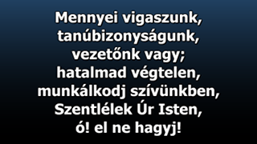
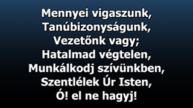
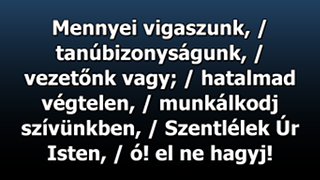

# Az énekszöveg átalakító használata

Az énekszöveg átalakító parancssorból indítható, a letöltött és kicsomagolt mappában állva a következő paranccsal:

`> php utils/compile.php`

Az átalakító a válaszoktól függően 5-10 kérdést tesz fel azzal kapcsolatban, hogy milyen legyen a végleges szöveg.
A kérdések egy része magára a szöveg formázására vonatkozik, más része a végeredmény formátumára.
A kérdések a következők:

* **Legyen nyitó dia az ének címével?**

  A gyűjtemény szándékosan úgy lett elkészítve, hogy nem tartalmaz nyitó diát. Ennek az az oka, hogy ha szükség van a nyitó diára, akkor azt egyszerűbb legenerálni és beszúrni az összes elé, mint egy meglevő nyitó dia tartalmát módosítani/törölni. Mivel jelenleg egyetlen éneknek sincs nyitó diája, az erre a kérdésre adott igen válasszal az énekeknek lesz nyitó diája:

  

  * **Szerepeljen a nyitó dián az énekeskönyv neve?**

    Ha az első kérdés alapján lesz nyitó dia, akkor annak tartalma kiegészíthető az elsődleges énekeskönyv nevével.
    Egy ének több énekeskönyvben is szerepelhet, ilyenkor mindegyik énekeskönyv felsorolásra kerül az ének szövegében,
    de a nyitódiára csak az elsődleges énekeskönyv neve kerül feltüntetésre, ha erre a kérdésre is igen a válasz:

     

  * **Szerepeljen a nyitó dián az ének sorszáma?**

    Ha a nyitó dián szerepel az énekeskönyv neve, akkor feltüntethető az elsődleges énekeskönyvbeli sorszám is az
    erre a kérdésre adott igen válasszal:

    

* **Az énekszöveg soronként legyen tördelve?**

  Az ének követhetőségét növeli, ha egy lélegzetvételnyi szöveg egy sorba kerül, ekkor azonban a szöveg méretét
  csökkenteni kell ahhoz képest, mintha az ének szövege sorfolytonosan következne és csak az énekvetítő program tördelné a szöveget tetszőleges helyeken. Az automatikus tördelés ellen szól, hogy például a névelők logikailag az azt követő szóhoz
  tartoznak, de rövidségük folytán még beférnek az előző sor végére, így a szemnek bántóvá válik az automatikus
  tördelés. A gyűjteményben alapértelmezetten minden ének soronként van tördelve, de ez azért van így, mert ez teszi lehetővé ezt a választási lehetőséget (a sortörések automatikusan eltávolíthatók, de de sortörések automatikusan nem helyezhetők el). Az alábbi képernyőfotókon látható a tördelt és a tördeletlen szövegváltozat közötti különbség:

  
  

  * **A sorok első betűje legyen nagybetűs?**

    Ez a kérdés csak akkor jelenik meg, ha az előző kérdésben a soronkénti tördelés lett választva. Ebben az esetben
    kérhető az, hogy minden sor első betűje legyen automatikusan nagybetűs. Az előző tördelt szöveget bemutató képernyőfotón a nagybetűsítés nélküli állapot tekinthető meg, a következő képen pedig a nagybetűsített:

    

  * **A sorok legyenek perjellel (/) elválasztva?**

    Ez a kérdés csak akkor jelenik meg, ha a soronkénti tördelés _nem_ lett választva. Annak érdekében, hogy a
    sorfolytonos szöveg ne follyon úgy egybe, a Hitünk Énekei énekeskönyvben alkalmazott módszerrel, a perjellel
    elválaszthatóak a sorok és jobban kiemelésre kerülnek a lélegzetvétel helyei. A következő képernyőfotón látható
    ez működés közben:

    

* **Az ismétlődő diák (refrén) ismétlődjenek?**

    Helytakarékos megoldás az, hogy az ismétlődő diák (pl. refrén) csak egyszer, első előfordulásukkor
    szerepelnek a szövegben és ilyenkor a vetítést kezelőnek kell figyelnie arra, hogy melyik dia után
    melyiket vetíti. Az OpenLP is alkalmazza ezt a helytakarékos megoldást, de ott a diaszerkesztőben
    megadható a diák sorrendje, így vetítésbe már a program úgy ütemezi az éneket, hogy az ismétlődéseket
    is beleteszi. Ezért OpenLP esetében javasolt erre a kérdésre a nem válasz. Más énekvetítő programok
    alkalmazása esetén nincs ez az automatikus szolgáltatás, így ott a vetítés zavartalansága érdekében
    érdemes az átalakító programmal ismételtetni az ismétlődő diákat az erre a kérdésre adott igen válasszal.

* **Legyen utolsó utáni üres dia?**

    Az utolsó versszak után a vetítést kezelő feladata, hogy a kivetített szöveg képét levegye. Ha
    figyelmetlenségből az utolsó dia után léptetni akar, akkor programtól függően vagy nem lép tovább,
    mert nincs több dia, vagy az ütemezőben szereplő következő éneket kezdi el kivetíteni. Ezt megakadályozandó
    lehetőség van arra, hogy az átalakító program az utolsó dia után elhelyezzen egy üres diát, amely
    figyelmetlenség esetén is segít, hogy ne történjen galiba: csak ez az üres dia lesz kivetítve. Ha
    szükség van erre a szolgáltatásra, akkor erre a kérdésre igen-t kell válaszolni.

    

  * **Legyen az utolsó utáni üres dián gyorskereső hivatkozás?**
  
    Ez a kérdés csak akkor jelenik meg, ha az előző kérdésre igen volt a válasz. Az utolsó utáni dia
    (ha soha nincs kivetítve) felhasználható arra is, hogy olyan szöveget tartalmazzon, ami segít az
    adott éneket megtalálni a keresőben. Például az EasyWorship 2009 és az azelőtti változatokban a
    felső keresővel csak ének címére lehetett keresni, az alsó keresővel pedig a diák kezdetére. Ha
    az utolsó utáni dia tartalmaz egy HE242 szöveget, akkor az EasyWorship lenti keresőjével,
    ezt begépelve megvalósítható az ének sorszámára történő keresés, ami egyébként nem megvalósítható.
    Ha erre a kérdésre igen a válasz, akkor az utolsó utáni dia ezt a hivatkozást fogja tartalmazni,
    régi EasyWorship esetén javasolt, más esetben nincs jelentősége.

    

* **Milyen formátumba kerüljenek az énekek?**

  Itt célszerű azt a programot/formátumot választani, ami a legközelebb áll az általunk használt
  vetítő programhoz. Az énekszöveg átalakító úgy lett kialakítva, hogy a kimeneti formátumok
  igény esetén utólag is szabadon bővíthetők, de jelenleg a következő formátumok léteznek:

  * EasyWorship

  Az általunk választott EasyWorship formátum a számunkra fellelhető legkorábbi EasyWorship
  program (v2.3.11) Schedule formátuma, amelyet a felfele történő kompatibilitás miatt minden
  ezt követő EasyWorship program be tud olvasni. Az EasyWorship esetén a Schedule fájl
  használata azért jó, mert megnyitásakor az EasyWorship megjelenít egy importálás varázslót,
  amely segít az énekek adatbázisba töltéséhez.

  * OpenLP

  Az énekszöveg átalakító ezt a formátumot választva egy (vagy több) zip fájlt hoz létre,
  amelyben elhelyezi az átalakított énekeket OpenLyrics xml formátumba, amelyet az OpenLP
  be tud importálni. Ha az énekszöveg átalakító nem tud olyan kimenetet biztosítani, megfelelő
  lenne a saját énekvetítő szoftverhez, akkor célszerű ezt a formátumot választani, mert
  a legtöbb program ezt a formátumot tudja importálni.

  * PowerPoint

  Ha semmilyen énekvetítő szoftver nem áll rendelkezésre, a PowerPoint még akkor is kéznél lehet.
  Ennek a formátumnak a vetítése kissé nehézkesebb, mint az erre specializált szoftvereké,
  de a semmitől jóval több. Ezen formátum használatakor kifejezetten tanácsos például az utolsó
  utáni üres dia kérése a fenti kérdésnél. Az elkészült énekek külön-külön pptx fájlokba kerülnek,
  de azok egyetlen (vagy néhány több) zip fájlban kerülnek átadásra.

  * Quelea

  A Quelea programnak van egy saját xml formátuma is, ehhez a programhoz célszerű ezt választani
  az OpenLyrics importálása helyett.

  * Szövegfájl

  Néha szükség lehet az énekek natúr szövegére. Ezt a formátumot választva megkapjuk az énekeket
  külön fájlonként, de egyetlen (vagy néhány több) zip fájlban.

* **Hány ének kerüljön egy fájlba?**

  Az előbbi formátumok mindegyike valamilyen konténer formátumba (ha más nem, akkor zip fájlba)
  helyezi az átalakított énekeket. Erre a kérdésre válaszolva azt lehet meghatározni, hogy egy
  konténerfájlba hány ének kerüljön. Akár Easyworship-nél is, de más énekvetítő programnál is
  tanácsos lehet száz, vagy néhány száz darabban maximalizálni az énekek számát, hogy az
  importálás ne okozzon hosszú időre lefagyást.

* **Mely énekeket szeretnéd átalakítani?**

  Innentől kezdődően az énekgyűjteményből lehet kiválogatni a szükséges énekeket. Egy mozdulattal
  az összes éneket is át lehet alakítani, de lehet válogatni énekeskönyvenként és azon belül is
  énekeket tartományban, vagy egyesével. Pl. az 1-5,10,12-14 megadásával az 1, 2, 3, 4, 5, 10, 12, 13, 14.
  számú énekek kerülnek átalakításra.

Ha mindezek a kérdések megválaszolásra kerülnek, a válaszok mentésre kerülnek a
/compilations/compile.settings.ini fájlba, amely a következő átalakításkor visszatölthető
(első kérdés lesz a korábbi összeállítás használata). Ezek után egy újabb átalakítás ugyanezen
formátumra már két igen választ követően megtörténik.

Az elkészült, átalakított fájlok a /compilations mappába kerülnek.
